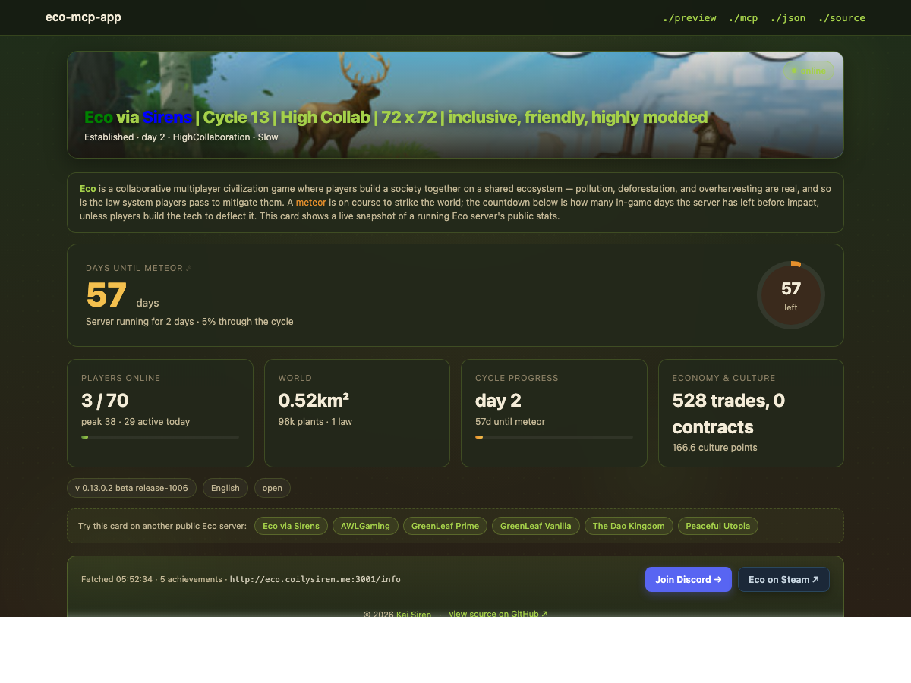

[](https://store.steampowered.com/app/382310/Eco/)

<sub>Banner: Steam header for Eco by [Strange Loop Games](https://strangeloopgames.com/). Used here for attribution; not my artwork.</sub>

# eco-mcp-app

An inline Claude Desktop widget for any public **Eco** game server [1] — point it
at the "Eco via Sirens" [2] server (the default) or any other Eco server by IP
or hostname. Ask Claude "what's the Eco server doing?" and you get a live card
back: meteor countdown, online/total players, world size, laws, economy,
Discord CTA, a link to Eco on Steam. No screenshots, no tab-switching. Cards
you don't have data for just aren't rendered.

It's also a tech demo — a minimal, hand-rolled MCP Apps implementation [3]
without a bundler or React, so the whole iframe is one 300-line HTML file.
Useful as a reference for anyone else building an MCP App in Python rather
than the default TypeScript/ext-apps [4] stack.


[](https://eco-mcp.coilysiren.me/preview)

<sub>Live at [eco-mcp.coilysiren.me/preview](https://eco-mcp.coilysiren.me/preview) — the same HTML Claude Desktop renders inline via the MCP Apps spec.</sub>

## What it renders

```
┌─ Eco via Sirens ─────────── Established · day 2 · HighCollaboration · Slow ─ ● online ─┐
│                                                                                       │
│  DAYS UNTIL METEOR ☄                                          ┌─────┐                  │
│  57 days                                                      │ 57  │  (cycle ring,   │
│  Server running for 2 days · 5% through the cycle             │ left│  fills as days  │
│                                                               └─────┘   tick down)    │
│                                                                                       │
│  ┌ Players online ┐ ┌ World       ┐ ┌ Cycle progress  ┐ ┌ Economy & culture ┐        │
│  │ 7 / 67         │ │ 0.52 km²    │ │ day 2           │ │ 473 trades,       │        │
│  │ peak 38        │ │ 96k plants  │ │ 57d until ☄     │ │   0 contracts     │        │
│  │ ░░░░█░░░░░░░░░ │ │ 0 animals   │ │ ██░░░░░░░░░░░░░ │ │ 171.0 culture     │        │
│  └────────────────┘ └─────────────┘ └─────────────────┘ └───────────────────┘        │
│                                                                                       │
│  [v 0.13.0.2] [English] [open] [admin online]         Fetched 4:12 PM · [Join Discord]│
└───────────────────────────────────────────────────────────────────────────────────────┘

          · · · .        ·     .                 . ·
     .        ·   .    *   .          ·   . (animated starfield, twinkling)
       *              .         *                 ·
                                                         ☄ (meteor, floats)
                                                       ↙
                                                     ↙
```

## How it works

The server (`src/eco_mcp_app/server.py`) exposes one tool,
`get_eco_server_status`, which hits `http://eco.coilysiren.me:3001/info` (the
public `/info` endpoint Eco [1] servers expose by default), redacts player
names, and returns two content blocks: a markdown fallback for text-only
hosts, and a JSON payload for the iframe. The tool's `_meta.ui.resourceUri`
points at `ui://eco/status.html`, which is the iframe HTML registered as a
resource.

The iframe (`src/eco_mcp_app/ui/eco.html`) is plain HTML/CSS/JS — no build
step, no bundler, no React. It hand-rolls the MCP Apps initialization
handshake per the spec [5]:

1. Iframe → host: `ui/initialize` (request, with `protocolVersion: 2026-01-26`)
2. Host → iframe: initialize result
3. Iframe → host: `ui/notifications/initialized` (notification)
4. Host → iframe: `ui/notifications/tool-result` whenever a matching tool fires

The handshake is ~30 lines. The ext-apps SDK [4] does more (auto-resize,
capability negotiation), but for a read-only dashboard we don't need any of
it — and writing it out makes the spec readable.

## See also

This repo sits next to a small Eco ecosystem: `eco-spec-tracker` [6] is the
direct sibling read-only dashboard (same FastAPI + Jinja2 + HTMX stack, paired
with a C# mod that publishes per-player job specs); `eco-cycle-prep` [7] runs
per-cycle setup (worldgen, Discord announcements, mod sync); `eco-mods-public` [8]
is where the gameplay mods live. The deploy pattern (Dockerfile, Makefile,
k8s manifest, GH Actions) is cloned from `coilysiren/backend` [9], which is
the canonical template for the homelab k3s + GHCR + Tailscale + cert-manager
stack. Eco itself is by [Strange Loop Games](https://strangeloopgames.com/);
canonical references: ModKit [10], modding docs [11], Eco wiki modding page [12],
the Discord bridge plugin [13], and mod catalog [14].

## Available tools

- **`get_eco_server_status`** — live status of any public Eco server. Returns
  three content blocks: a markdown summary (for text-only hosts), a JSON
  payload with every field the UI consumes, and an HTMX fragment that
  Claude Desktop swaps into the iframe via the MCP Apps protocol.
  - Optional argument: `server` (string) — a bare host (`eco.example.com`),
    `host:port` (`10.0.0.5:4001`), or a full `/info` URL. Omit to use the
    server configured via the `ECO_INFO_URL` env var (defaults to Kai's
    server, `http://eco.coilysiren.me:3001/info`).

- **`list_public_eco_servers`** — returns the curated set of public Eco
  servers bundled with this MCP (label, host:port, notes). Feed any `host`
  back into `get_eco_server_status` as the `server` argument. Useful for
  LLMs that want to discover what's queryable without calling the tool
  blind. No arguments.

## Installation

The fastest path is the hosted instance — no install, no Python, just point
your client at a URL. For offline work or custom Eco server defaults, pick
one of the stdio options.

### Option 1 — Hosted HTTP (no install)

A public instance is live at **`https://eco-mcp.coilysiren.me/mcp/`**, speaking
MCP over Streamable-HTTP (stateless, CORS open). Any client that can connect
to a remote MCP server works. Supports `get_eco_server_status` against any
public Eco server you pass via the `server` argument — you don't need to run
your own instance to query a different server.

### Option 2 — Stdio via `uvx` (recommended for local use)

[`uvx`](https://docs.astral.sh/uv/guides/tools/) fetches + runs the package
in a one-shot venv. No install step, no Python version management.

```sh
uvx --from git+https://github.com/coilysiren/eco-mcp-app eco-mcp-app
```

### Option 3 — Stdio via local checkout

```sh
git clone https://github.com/coilysiren/eco-mcp-app
cd eco-mcp-app
uv sync
uv run eco-mcp-app
```

### Option 4 — Docker (HTTP transport)

The published image runs the Streamable-HTTP transport on port 4000:

```sh
docker run --rm -p 4000:4000 \
  ghcr.io/coilysiren/eco-mcp-app/coilysiren-eco-mcp-app:latest
# MCP endpoint at http://localhost:4000/mcp/
```

## Configuration

Every MCP client takes a slightly different config shape. Pick your client
below. The `ECO_INFO_URL` env var is always optional — omit it to use Kai's
server as the default.

### Claude Desktop

`~/Library/Application Support/Claude/claude_desktop_config.json` on macOS,
`%APPDATA%\Claude\claude_desktop_config.json` on Windows. **Fully quit + relaunch
Claude Desktop after editing — it only loads MCPs at startup.**

<details>
<summary>Stdio via <code>uvx</code> (recommended)</summary>

```json
{
  "mcpServers": {
    "eco-mcp-app": {
      "command": "uvx",
      "args": ["--from", "git+https://github.com/coilysiren/eco-mcp-app", "eco-mcp-app"]
    }
  }
}
```
</details>

<details>
<summary>Stdio via local checkout</summary>

```json
{
  "mcpServers": {
    "eco-mcp-app": {
      "command": "uv",
      "args": ["run", "--directory", "/path/to/eco-mcp-app", "eco-mcp-app"]
    }
  }
}
```

Or run `python scripts/install-desktop-config.py` from a local checkout to
splice this block in automatically.
</details>

<details>
<summary>Remote HTTP (hosted)</summary>

Claude Desktop supports remote MCP servers via the **Settings → Connectors**
UI — add `https://eco-mcp.coilysiren.me/mcp/` there. The visual MCP Apps card
only renders inside Claude Desktop's chat UI for remote servers when the host
advertises the `io.modelcontextprotocol/ui` extension capability.
</details>

### Claude Code

Project-scoped `.mcp.json` at the repo root (picked up automatically), or
merge into your user-wide MCP config:

<details>
<summary>Stdio via <code>uvx</code></summary>

```json
{
  "mcpServers": {
    "eco-mcp-app": {
      "command": "uvx",
      "args": ["--from", "git+https://github.com/coilysiren/eco-mcp-app", "eco-mcp-app"]
    }
  }
}
```
</details>

<details>
<summary>Remote HTTP (hosted)</summary>

```sh
claude mcp add --transport http eco-mcp-app https://eco-mcp.coilysiren.me/mcp/
```
</details>

### Cursor / Windsurf / Continue / Cline

These all read an `mcpServers` map — same shape as Claude Desktop. Path:

- **Cursor** — `~/.cursor/mcp.json` (user) or `.cursor/mcp.json` (project)
- **Windsurf** — `~/.codeium/windsurf/mcp_config.json`
- **Continue** — `~/.continue/config.json` under `experimental.modelContextProtocolServers`
- **Cline** — VS Code settings, `cline.mcpServers`

```json
{
  "mcpServers": {
    "eco-mcp-app": {
      "command": "uvx",
      "args": ["--from", "git+https://github.com/coilysiren/eco-mcp-app", "eco-mcp-app"]
    }
  }
}
```

### Zed

`~/.config/zed/settings.json`:

```json
{
  "context_servers": {
    "eco-mcp-app": {
      "command": {
        "path": "uvx",
        "args": ["--from", "git+https://github.com/coilysiren/eco-mcp-app", "eco-mcp-app"]
      }
    }
  }
}
```

### Generic (pinning a specific Eco server as default)

Set `ECO_INFO_URL` to point the default query at your own Eco server:

```json
{
  "mcpServers": {
    "eco-mcp-app": {
      "command": "uvx",
      "args": ["--from", "git+https://github.com/coilysiren/eco-mcp-app", "eco-mcp-app"],
      "env": {
        "ECO_INFO_URL": "http://my-eco-server.example.com:3001/info"
      }
    }
  }
}
```

Callers can still pass a `server` argument per-tool-call to override.

### Try it

In a fresh chat, after any install method:

> *Use eco-mcp-app to show me the Eco server status.*

You should get the meteor card inline in Claude Desktop, or a markdown
summary everywhere else.

## Try it on other public Eco servers

The tool and the `/preview` dev route both accept a `server` argument — host,
`host:port`, or a full `/info` URL — so the same card UI works against any
public Eco server. Useful for eyeballing rendering against real-world titles
(TextMeshPro color markup, missing cards, stale meteor cycles, etc.). Server
list is from [eco-servers.org](http://eco-servers.org/).

| Server | Live | Local |
|---|---|---|
| **Eco via Sirens** (default, this repo) | [preview](https://eco-mcp.coilysiren.me/preview) | [preview](http://localhost:4000/preview) |
| **AWLGaming** — hex + named color mix, meteor imminent | [preview](https://eco-mcp.coilysiren.me/preview?server=ecoserver.awlgaming.net:5679) | [preview](http://localhost:4000/preview?server=ecoserver.awlgaming.net:5679) |
| **GreenLeaf Prime** — `<#RRGGBB>` shorthand rainbow | [preview](https://eco-mcp.coilysiren.me/preview?server=eco.greenleafserver.com:3021) | [preview](http://localhost:4000/preview?server=eco.greenleafserver.com:3021) |
| **GreenLeaf Vanilla** — same host, vanilla ruleset | [preview](https://eco-mcp.coilysiren.me/preview?server=eco.greenleafserver.com:3031) | [preview](http://localhost:4000/preview?server=eco.greenleafserver.com:3031) |
| **The Dao Kingdom** — short-form hex + explicit `</color>` closes | [preview](https://eco-mcp.coilysiren.me/preview?server=daokingdom.eu:3001) | [preview](http://localhost:4000/preview?server=daokingdom.eu:3001) |
| **Peaceful Utopia** — no markup, meteor already passed | [preview](https://eco-mcp.coilysiren.me/preview?server=eco.bleedcraft.com:3001) | [preview](http://localhost:4000/preview?server=eco.bleedcraft.com:3001) |

Local variants expect `inv http` (or the project's SessionStart hook) to be
running on `:4000`. `/info` is served on `game_port + 1`, so `:3000` game
servers advertise `/info` on `:3001` — the links above use the `/info` port.

## Deploy (homelab)

Target: `eco-mcp.coilysiren.me` on the k3s cluster, following the template in
`coilysiren/backend` [9] (same Dockerfile/Makefile/deploy shape). The server
speaks MCP over Streamable-HTTP at `/mcp/` via `src/eco_mcp_app/http_app.py`
(Starlette + `StreamableHTTPSessionManager` in stateless mode). Health probe
at `/healthz`.

Pipeline: `.github/workflows/build-and-publish.yml` builds the image and
pushes to `ghcr.io/coilysiren/eco-mcp-app/...` on every push to `main`, then a
second job uses Tailscale to reach the cluster and applies `deploy/main.yml`
via `make .deploy`. The manifest is self-bootstrapping — the `Namespace` lives
at the top of `deploy/main.yml` so the first deploy creates it alongside the
Deployment / Service / Ingress in a single `kubectl apply`. No manual cluster
prep needed.

After the first `git push` publishes the image to GHCR, make the package
public at
<https://github.com/users/coilysiren/packages/container/eco-mcp-app%2Fcoilysiren-eco-mcp-app/settings>
(Package settings → Change visibility → Public). Packages inherit from the
repo but only on first push; they default to private. With a public image, no
`imagePullSecrets` is needed. If you flip the package back to private later,
run `make deploy-secrets-docker-repo` once (pulls the GHCR PAT from
`aws ssm /github/pat` without reading it into your shell) and add the pull-secret
line back to `deploy/main.yml`.

Runtime has no secrets — the `/info` endpoint of the upstream Eco server is
public, and the tool accepts the target server as an argument so a single
deployment can query any public Eco server.

## Smoke test

The whole MCP → iframe → render flow is testable via stdio without Claude:

```sh
inv smoke
```

Look for: `_meta.ui.resourceUri` in both forms on `id=2`, a real-sized HTML
resource on `id=3`, and a JSON payload with `"view":"eco_status"` on `id=4`.

## Dev harness (iterate on the iframe without restarting Claude)

`static/harness.html` is a minimal HTML page that mimics Claude Desktop's MCP Apps
host so the iframe can be developed in a normal browser — no ⌘Q / relaunch
cycle per change. The harness:

1. Loads `src/eco_mcp_app/ui/eco.html` as an iframe (`visibility: hidden`).
2. Listens for `ui/initialize` from the iframe and responds with a valid
   `McpUiInitializeResult` (protocolVersion, hostInfo, hostCapabilities,
   hostContext).
3. On `ui/notifications/initialized`, reveals the iframe.
4. Listens for `ui/notifications/size-changed` and applies the reported
   `{width, height}` to `iframe.style.height`. This is the mechanism Claude
   Desktop actually uses — not the `documentElement.height` read that
   [claude-ai-mcp#69](https://github.com/anthropics/claude-ai-mcp/issues/69)
   describes.
5. After reveal, pushes a canned `ui/notifications/tool-result` with a mock
   Eco `/info` payload so `render()` runs.

Run it with:

```sh
inv harness
# then open http://localhost:8765/static/harness.html
```

The status bar at the top of the harness shows the last `size-changed` value
so you can see whether the iframe is telling the host to resize. If it says
"Loading…" forever, either the handshake failed or the iframe's script threw
before reaching `connect()` — check DevTools console.

The harness is also usable from Claude Code's Preview panel via the
`eco-harness` entry in `.claude/launch.json`.

## MCP Apps — non-obvious things I learned building this

- `_meta.ui.resourceUri` must be set in **both** nested (`ui.resourceUri`) and
  flat (`ui/resourceUri`) forms — some hosts only honor one [15].
- The MIME type has to be exactly `text/html;profile=mcp-app`; plain
  `text/html` does not trigger MCP Apps rendering.
- With no client-side JS running the handshake, Claude Desktop correctly
  leaves the iframe container at `visibility: hidden`. This means a no-script
  test HTML is not a valid isolation — it will look identical to a broken
  app [16].
- Claude Desktop's sandbox iframe enforces a hardcoded CSP that ignores
  `_meta.ui.csp` extensions [17]. External image origins get blocked. If you
  need thumbnails, inline them server-side as `data:image/...;base64,...`
  URIs — those are always permitted.
- Only Claude Desktop chat UI (`clientInfo.name = "claude-ai"`) advertises
  the `io.modelcontextprotocol/ui` extension capability. Claude Code
  Desktop's agent harness (`clientInfo.name = "local-agent-mode-*"`) does
  not, so iframes never render there — use its Launch preview panel
  (triggered by a `Write` or `Edit` tool call on a local HTML file) as the
  fallback inline-visualization path.

## License

MIT.

## References

1. <https://play.eco/>
2. <https://www.coilysiren.me/>
3. <https://modelcontextprotocol.io/docs/concepts/apps>
4. <https://github.com/modelcontextprotocol/ext-apps>
5. <https://github.com/modelcontextprotocol/ext-apps/blob/main/specification/2026-01-26/apps.mdx>
6. <https://github.com/coilysiren/eco-spec-tracker>
7. <https://github.com/coilysiren/eco-cycle-prep>
8. <https://github.com/coilysiren/eco-mods-public>
9. <https://github.com/coilysiren/backend>
10. <https://github.com/StrangeLoopGames/EcoModKit>
11. <https://docs.play.eco/>
12. <https://wiki.play.eco/en/Modding>
13. <https://github.com/Eco-DiscordLink/EcoDiscordPlugin>
14. <https://mod.io/g/eco>
15. <https://github.com/anthropics/claude-ai-mcp/issues/71>
16. <https://github.com/anthropics/claude-ai-mcp/issues/61#issuecomment-4283640203>
17. <https://github.com/anthropics/claude-ai-mcp/issues/40>

<!-- reference definitions below are invisible in rendered Markdown;
     they make the [N] tokens in the body clickable without a second visible list. -->

[1]: https://play.eco/
[2]: https://www.coilysiren.me/
[3]: https://modelcontextprotocol.io/docs/concepts/apps
[4]: https://github.com/modelcontextprotocol/ext-apps
[5]: https://github.com/modelcontextprotocol/ext-apps/blob/main/specification/2026-01-26/apps.mdx
[6]: https://github.com/coilysiren/eco-spec-tracker
[7]: https://github.com/coilysiren/eco-cycle-prep
[8]: https://github.com/coilysiren/eco-mods-public
[9]: https://github.com/coilysiren/backend
[10]: https://github.com/StrangeLoopGames/EcoModKit
[11]: https://docs.play.eco/
[12]: https://wiki.play.eco/en/Modding
[13]: https://github.com/Eco-DiscordLink/EcoDiscordPlugin
[14]: https://mod.io/g/eco
[15]: https://github.com/anthropics/claude-ai-mcp/issues/71
[16]: https://github.com/anthropics/claude-ai-mcp/issues/61#issuecomment-4283640203
[17]: https://github.com/anthropics/claude-ai-mcp/issues/40
